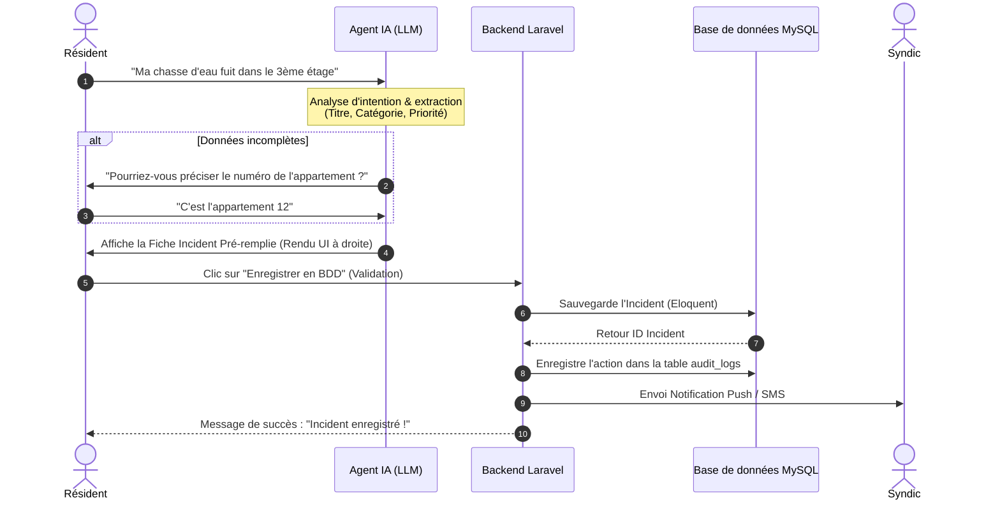
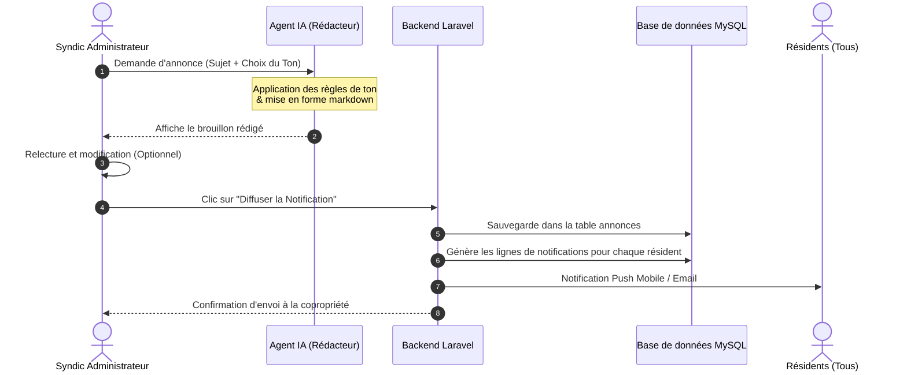
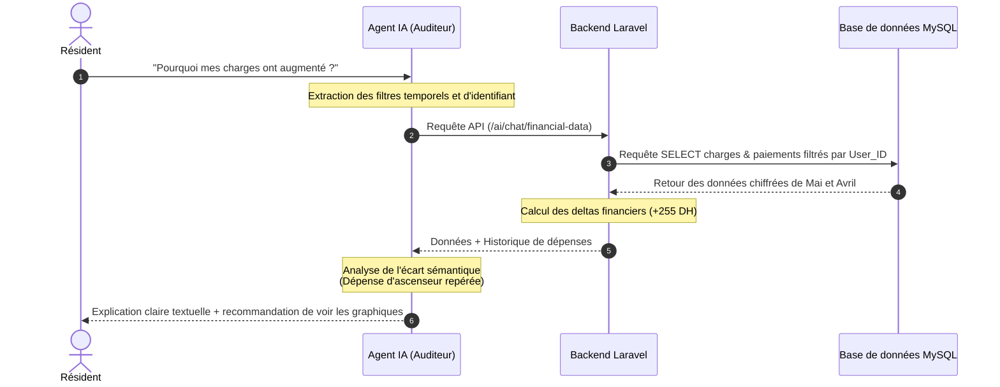

# 🔄 Flux Opérationnels de l'Agent IA (Workflows)

Ce document décrit pas-à-pas les flux d'exécution (workflows) obligatoires que l'**Agent IA** d'ImmoSyndic doit suivre lors de l'interaction avec le système. Ces workflows garantissent la cohérence des transactions et empêchent les actions arbitraires.

---

## 🟢 Workflow #1 : Saisie & Persistance d'un Incident Technique

Ce workflow décrit le cycle de vie de la déclaration d'un incident, depuis le chat résident jusqu'à l'enregistrement dans la base MySQL.

### 📋 Description des Étapes :
1. **Étape 1 :** Le résident décrit le problème en langage naturel.
2. **Étape 2 :** L'Agent IA analyse et catégorise le message.
3. **Étape 3 :** *Clarification* (si nécessaire) : L'IA pose des questions courtes si des variables critiques (ex: étage, bloc, urgence) sont floues.
4. **Étape 4 :** L'IA renvoie un schéma de données (Tool Call) qui se matérialise instantanément sous forme de carte interactive de prévisualisation dans l'interface utilisateur.
5. **Étape 5 :** Le résident clique sur le bouton **"Enregistrer en BDD"** pour soumettre le formulaire extrait.
6. **Étape 6 :** Le backend Laravel valide et enregistre dans la table `incidents` de MySQL.
7. **Étape 7 :** Une notification push et un log d'audit sont immédiatement créés.

---

## 🔵 Workflow #2 : Génération et Diffusion d'Annonces par le Syndic

Ce workflow encadre la communication de groupe rédigée avec l'assistance de l'IA.

### 📋 Description des Étapes :
1. **Étape 1 :** Le Syndic entre le sujet brièvement et choisit un ton d'expression.
2. **Étape 2 :** L'Agent IA génère un texte structuré en markdown, clair et professionnel, respectant la charte de sécurité.
3. **Étape 3 :** Le brouillon s'affiche dans un éditeur WYSIWYG (ex: Tiptap) permettant au syndic de faire des ajustements mineurs.
4. **Étape 4 :** Le syndic valide la diffusion.
5. **Étape 5 :** Le backend enregistre l'annonce en base de données et distribue individuellement la notification push à tous les résidents concernés.

---

## 🟡 Workflow #3 : Audit & Explication Personnalisée des Charges

Ce workflow décrit comment l'IA interroge et présente les données financières de manière sécurisée et rassurante.

### 📋 Description des Étapes :
1. **Étape 1 :** Le résident interroge l'IA sur l'évolution de sa facture.
2. **Étape 2 :** L'Agent IA appelle l'API interne sécurisée de Laravel avec l'ID du résident connecté (authentifié par Sanctum).
3. **Étape 3 :** Le backend Laravel récupère uniquement les charges et paiements du résident en base de données pour éviter toute fuite d'informations.
4. **Étape 4 :** L'Agent IA compare les rubriques de dépenses du mois actuel et du mois précédent.
5. **Étape 5 :** L'Agent IA isole la ligne de dépense ayant la plus forte hausse et rédige une explication textuelle simple, pédagogique et rassurante à afficher dans l'interface de chat.
