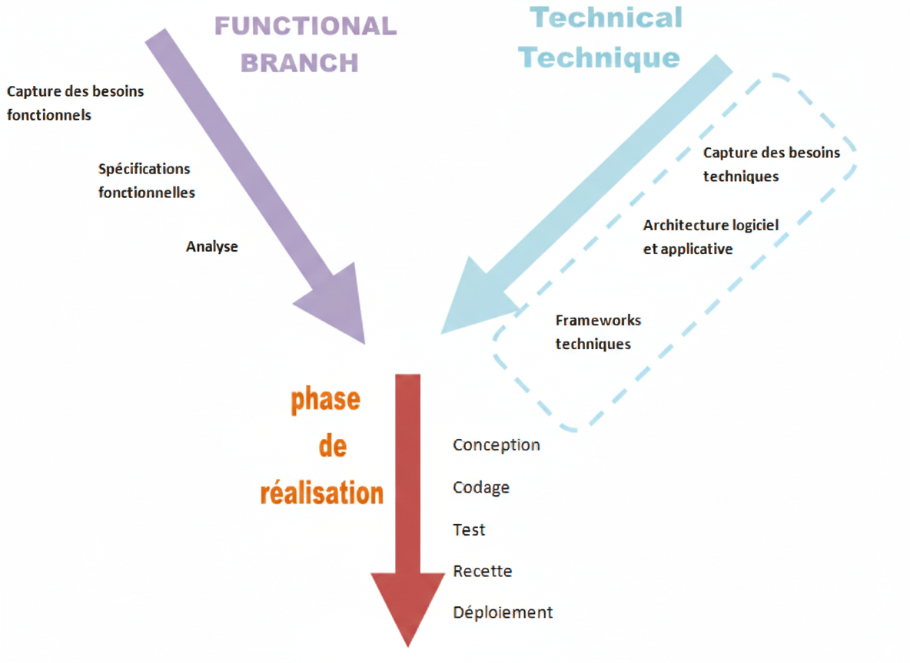
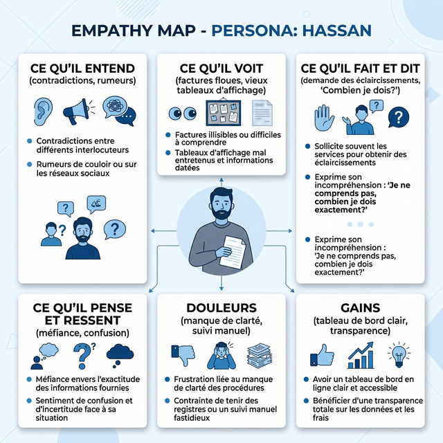
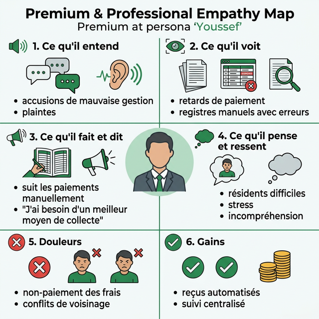
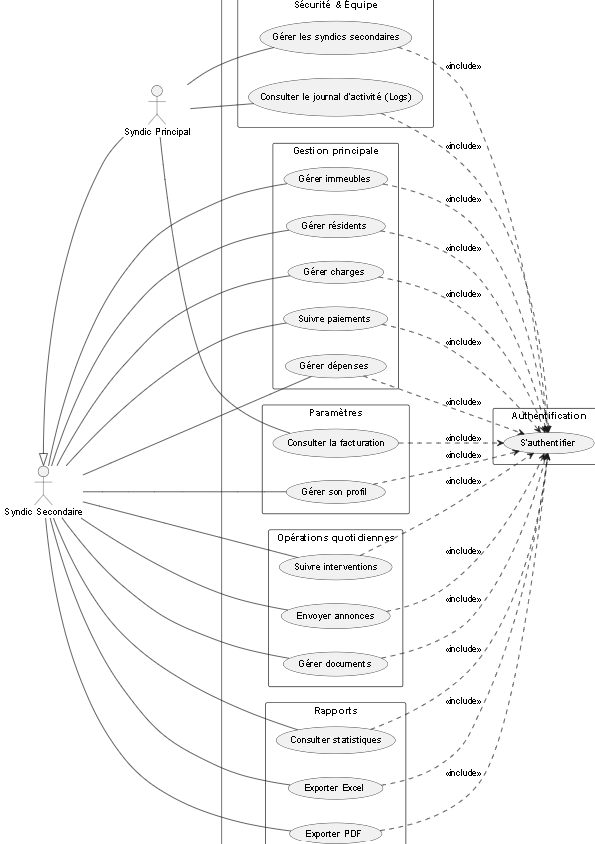
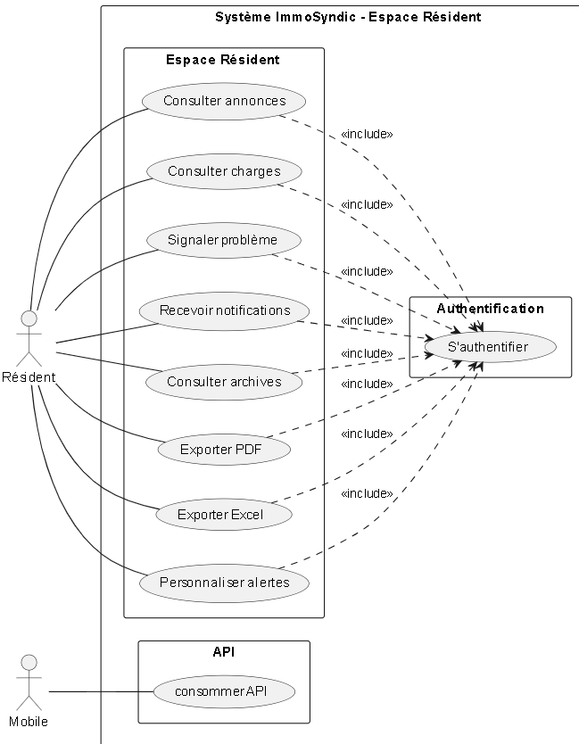
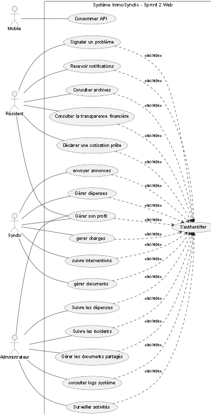
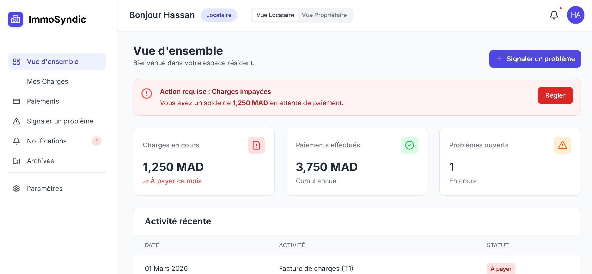
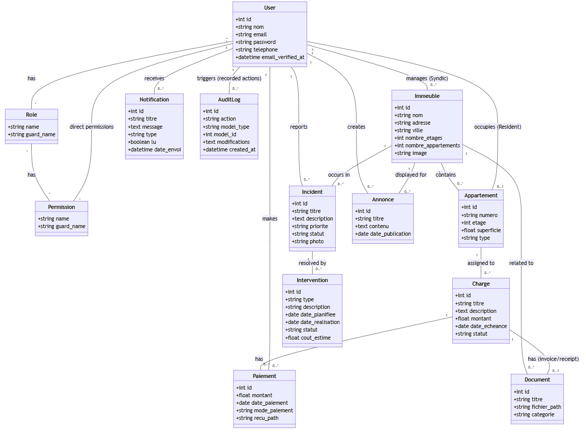

  
  

# **Projet de Fin de Formation**
### ImmoSyndic : Digitalisation de la Gestion du Syndic et des Immeubles

**Réalisé par :** FADNA LAKHOUCHEN  
**Encadré par :** M. ESSARRAJ Fouad  
**Filière :** Développement Mobile et Web

---

## Sommaire

  

1

Contexte du projet

  

2

Méthodologie de travail

  

3

Branche Fonctionnelle

  

4

Branche Technique

  

5

Conception

    

6

Démonstration

  

7

Conclusion

---

## 1. Contexte du projet

  

---

## 2. Méthodologie : Design Thinking

  

---

## Méthodologie : Scrum (Agile)

  

---

## Méthodologie : Processus 2TUP

  

---
## 3. Branche Fonctionnelle : Design Thinking
### 1. EMPATHIE : Résident (Hassan)

  

---

## Branche Fonctionnelle : Design Thinking
### 1. EMPATHIE : Résidente & Copropriétaire (Hasnae)

  

---

## Branche Fonctionnelle : Design Thinking
### 1. EMPATHIE : Syndic (Youssef)

  

---

## Branche Fonctionnelle : Design Thinking
### 1. EMPATHIE : Administrateur (Mohamed)

  

---

## Branche Fonctionnelle : Design Thinking
### 2. DÉFINITION

  

    <h4>Cadrage du problème</h4>
    <blockquote style="font-style: italic; background: white; padding: 15px; border-radius: 8px;">
     
 - Comment pouvons-nous améliorer la gestion des immeubles et des paiements tout en garantissant la transparence, la communication efficace et la réduction des conflits entre résidents et syndic ? 

    </blockquote>
  

---

## Branche Fonctionnelle : Cas d'utilisation

### Diagramme de cas d'utilisation global : Partie Administrateur 
### Espace Admin

  
  

---

## Branche Fonctionnelle : Cas d'utilisation

### Diagramme de cas d'utilisation global : Partie Syndic
### Espace Syndic

  

---

## Branche Fonctionnelle : Cas d'utilisation

### Diagramme de cas d'utilisation global : Partie Résident
### Espace Résident

  

---

## Branche Fonctionnelle : Cas d'utilisation

### Diagramme de cas d'utilisation global : Partie Mobile

  
  

---

## Branche Fonctionnelle : Cas d'utilisation - Sprint 1

  

---

## Branche Fonctionnelle : Cas d'utilisation - Sprint 2 

  

---
## Branche Fonctionnelle : Maquettes (UI/UX)

Interface Administration

  

    
    
  

---
## Branche Fonctionnelle : Maquettes (UI/UX)

Interface Syndic

  

    
  

---
## Branche Fonctionnelle : Maquettes (UI/UX)

Interface Résident

  

    
    
  

---

## 4. Branche Technique : Tech Stack

  

    <h4>Back-end & Architecture</h4>
    <ul>
      <li><strong>Framework :</strong> PHP 8 / Laravel 12</li>
      <li><strong>Database :</strong> MySQL / Eloquent</li>
      <li><strong>Architecture :</strong> MVC / 3-Tiers</li>
      <li><strong>Sécurité :</strong> Spatie (Rôles)</li>
    </ul>
  

  

    <h4>Front-end & Outils</h4>
    <ul>
      <li><strong>Styling :</strong> Blade / Tailwind CSS</li>
      <li><strong>UI / Icons :</strong> Preline UI / Lucide</li>
      <li><strong>Dynamic :</strong> JavaScript / Alpine.js</li>
      <li><strong>Build :</strong> Vite</li>
    </ul>
  

---

## 5. Conception : Diagramme de classe

 <h3>Modélisation des données (MLD)</h3>

 
  

---
## 6. Conclusion

### Merci pour votre attention !