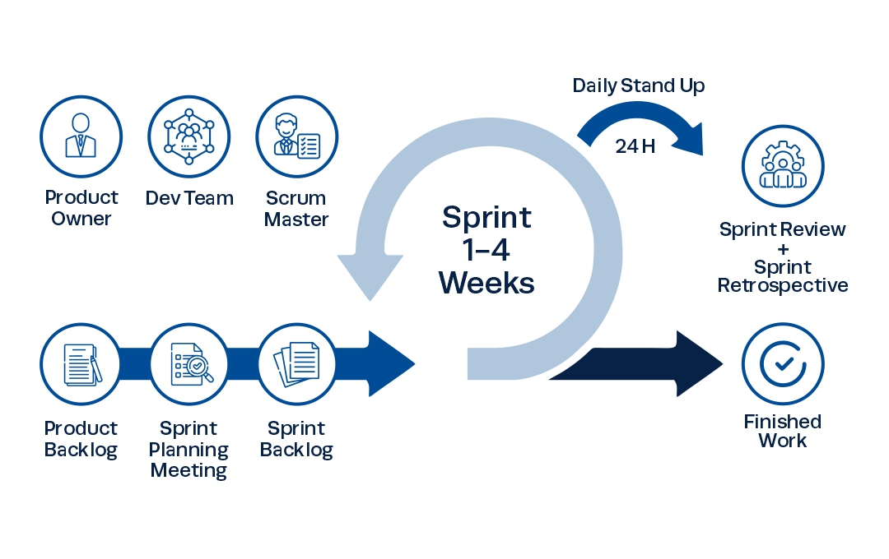
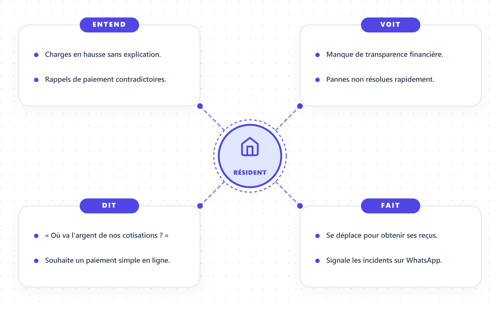
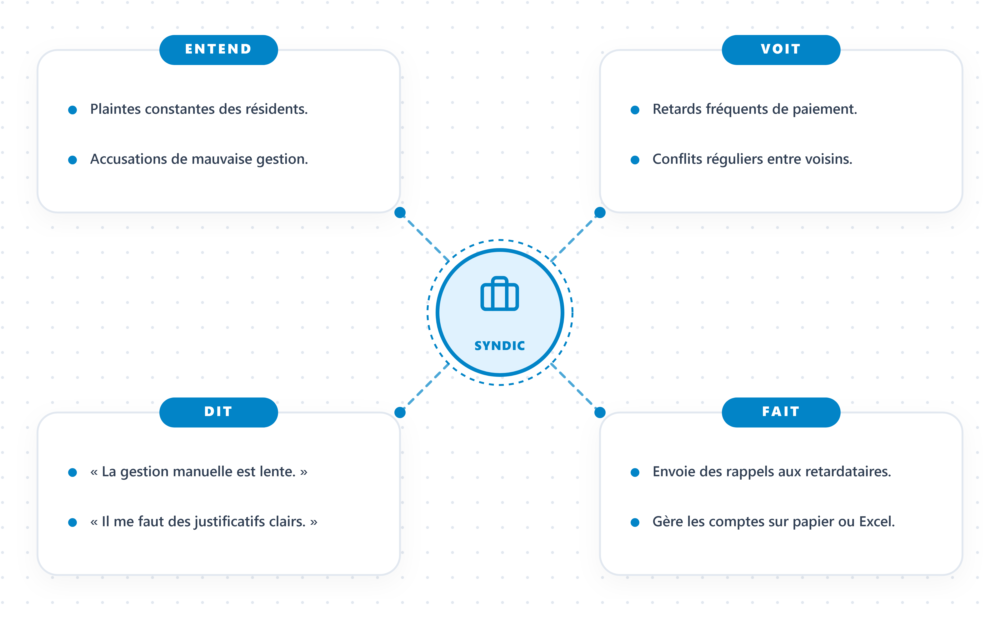
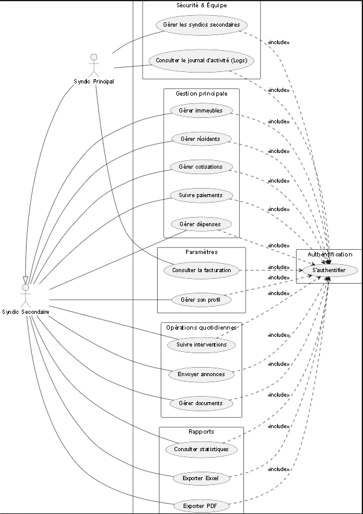
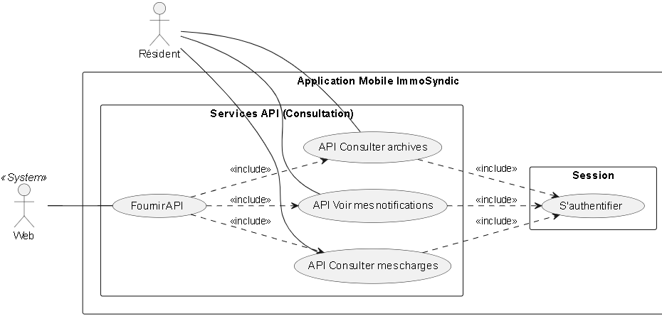
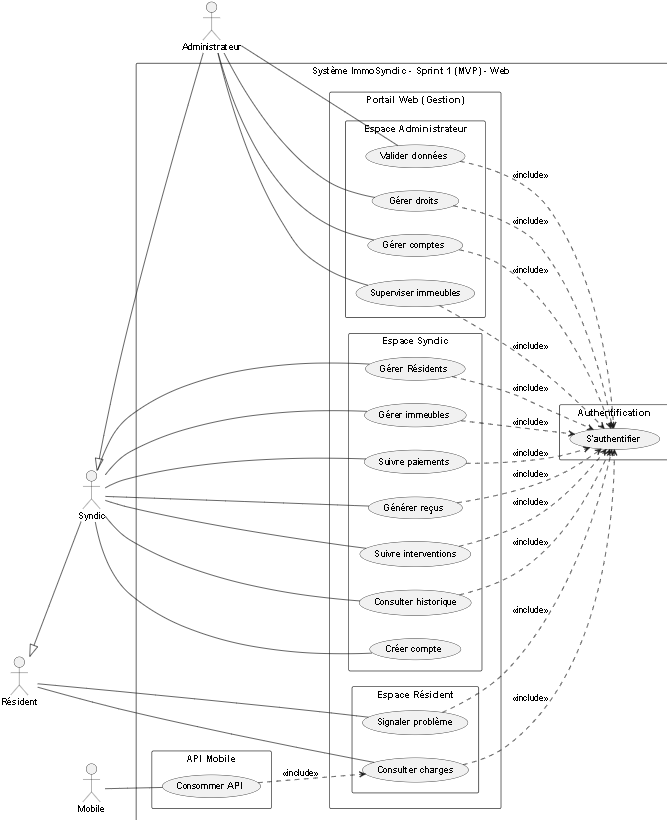
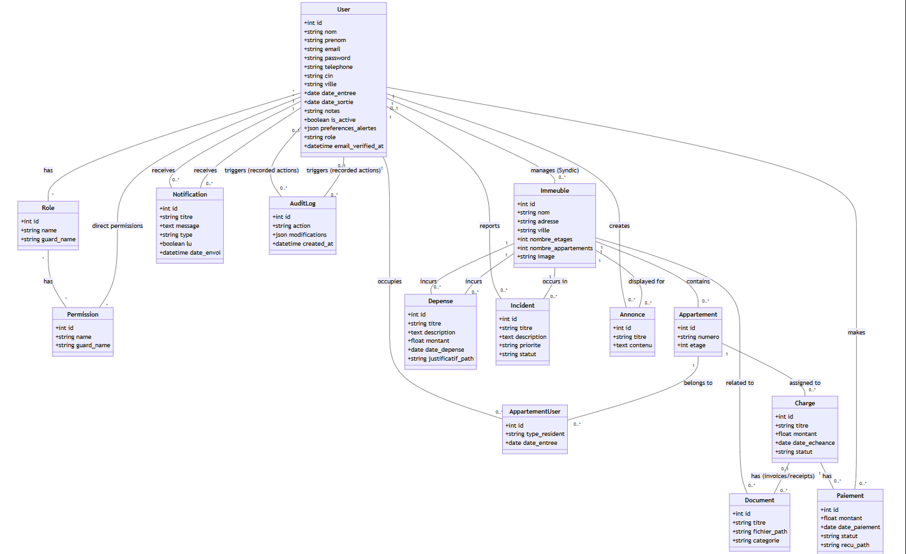
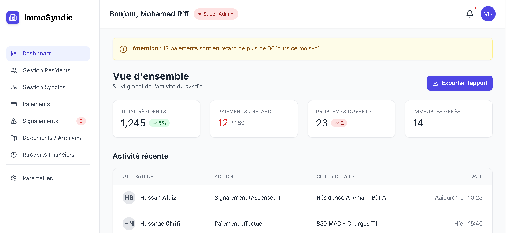
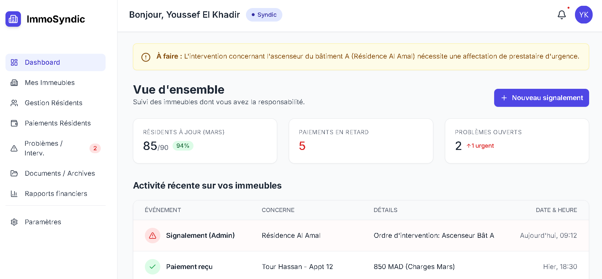

# Rapport de Fin formation
## ImmoSyndic : Digitalisation de la Gestion du Syndic et des Immeubles
### Formation de développement Mobile – Mode Bootcamp

**Réalisée par:** Fadna Lakhouchen  
**Encadré par:** Mr. Essarraj Fouad

**Année de Formation : 2025/2026**

---

## Table de matière

- Tables de matière 2
- Liste des figures 3
- Remerciement 4
- Introduction 4
- Contexte de projet 6
- Objectif de Project 7
- Cahier de charge 8
- Méthode de travail 9
  - Scrum 10
  - La méthodologie 2TUP 12
  - Design thinking 14
- Branche fonctionnelle 16
  - Carte d’empathie 17
  - Définition de problème 18
  - Diagramme de cas d’utilisation générale 19
  - Diagramme de cas d’utilisation sprint 1 20
  - Diagramme de cas d’utilisation sprint 2 21
- Branche technique 22
  - Choix technologiques 23
  - Architecture de projet 25
- Prototype (Fonctionnalitées, Classes) 29
- Conception 31
  - Diagramme de classe 32
  - Maquettes 33
  - Charte graphique 34
- Réalisation 35
  - Interfaces 36
- Conclusion 37

---

## Liste des figures

- Figure 1 : Méthodologie Scrum
- Figure 2 : Processus 2TUP
- Figure 3 : Méthodologie Design Thinking
- Figure 4 : Carte d’empathie - Hassan (Résident)
- Figure 5 : Carte d’empathie - Hasnae (Copropriétaire)
- Figure 6 : Carte d’empathie - Youssef (Syndic)
- Figure 7 : Carte d’empathie - Mohamed (Admin)
- Figure 8 : Cas d'utilisation Global - Administrateur
- Figure 9 : Cas d'utilisation Global - Syndic
- Figure 10 : Cas d'utilisation Global - Résident
- Figure 11 : Cas d'utilisation Global - Mobile
- Figure 12 : Cas d'utilisation - Sprint 1 (MVP)
- Figure 13 : Cas d'utilisation - Sprint 2 (Avancé)
- Figure 14 : Diagramme de classe (Conception)
- Figure 15 : Maquette de l'interface Dashboard

---

## Remerciement

Je souhaite exprimer ma profonde gratitude à toutes les personnes qui ont contribué au succès de mon projet de fin de formation. Un merci tout particulier à **M. Essarraj Fouad** pour son encadrement attentif, ses conseils pertinents et son soutien constant tout au long du projet.  

Je tiens également à remercier l’équipe de **Solicode** pour leur patience, leur accompagnement quotidien et pour avoir créé un environnement d’apprentissage agréable et stimulant.  

Enfin, je remercie mes camarades de promotion pour leur esprit d’entraide, leur bonne humeur et les moments partagés qui ont rendu cette expérience mémorable. Votre soutien et vos échanges ont été précieux pour la réussite de ce projet et de mon stage.

---

## Introduction

Dans le cadre de notre formation à Solicode, le projet « Digitalisation de la gestion du Syndic » a été réalisé pour répondre à un besoin réel dans la gestion des immeubles résidentiels. Actuellement, le suivi des charges et des paiements se fait souvent de manière manuelle, ce qui rend l’organisation difficile et peu transparente. Cette situation peut entraîner des retards, des erreurs et des conflits entre les résidents et le syndic.

L’objectif principal de ce projet est de concevoir une plateforme web permettant de centraliser les informations de l’immeuble et d’assurer un meilleur suivi des paiements. La solution proposée vise à améliorer la communication entre les acteurs et à garantir une gestion plus structurée et efficace.

Pour atteindre ces objectifs, une démarche agile a été adoptée, combinant l’approche Design thinking pour analyser les besoins des utilisateurs et la méthode Scrum pour organiser le développement par itérations successives.

---

## Contexte de projet

Le projet de digitalisation de la gestion du Syndic vise à améliorer l’organisation et le suivi des immeubles résidentiels. Il facilite la gestion des charges et des paiements ainsi que la communication entre le syndic et les résidents. Actuellement, la gestion se fait de manière manuelle à l’aide de documents papier. Cette méthode limite l’accès aux informations et complique la mise à jour des données. La mise en place d’une plateforme web permettra d’assurer une gestion plus efficace et transparente.

---

## Objectif de Project

Dans le cadre de ce projet, nous cherchons à développer une solution digitale qui simplifie la gestion des immeubles et facilite les interactions entre le syndic et les résidents. Cette solution doit permettre un suivi efficace des charges, améliorer la transparence des opérations financières et réduire les conflits tout en organisant les informations de manière claire et structurée. 

Le projet a pour objectifs principaux :
- proposer une solution digitale simple pour améliorer la gestion du syndic et faciliter le suivi des charges,
- mettre en place un système centralisé de gestion,
- faciliter le suivi des paiements des résidents,
- améliorer la transparence des opérations financières,
- réduire les conflits entre résidents et syndic,
- organiser les données de manière claire et structurée.

---

## Cahier de charge

### 1. Présentation du projet
**Nom du projet :** ImmoSyndic
**Type de projet :** Application Web et Mobile pour la gestion des immeubles et du syndic
**Bénéficiaires :** Résidents, copropriétaires, syndics et administrateurs

ImmoSyndic est une plateforme centralisée qui facilite la gestion des immeubles, le suivi des paiements et la communication entre tous les acteurs. Elle permet aux résidents de consulter leurs charges et interventions facilement, et aux syndics et administrateurs de gérer et analyser les informations efficacement.

### 2. Contexte et problème
Aujourd’hui, la gestion des immeubles est souvent réalisée manuellement ou via plusieurs outils disparates, ce qui entraîne :
- Difficultés pour suivre les paiements et charges en temps réel.
- Communication peu claire entre résidents, syndic et administrateur.
- Risque d’erreurs et doublons dans les informations financières.
- Manque de transparence et de traçabilité des opérations.

Comment pouvons-nous améliorer la gestion des immeubles et des paiements tout en garantissant la transparence, la communication efficace et la réduction des conflits entre résidents et syndic ?

### 3. Objectifs du projet
- Centraliser toutes les informations relatives aux immeubles et aux résidents.
- Permettre un suivi clair et automatique des paiements et des charges.
- Faciliter la communication entre résidents, syndics et administrateurs.
- Offrir des rapports financiers et des tableaux de bord précis.
- Réduire les conflits et améliorer la transparence des opérations.

### 4. Utilisateurs et rôles

**4.1 Résident**
- **Objectif :** Consulter ses charges, suivre ses paiements et signaler des problèmes.
- **Besoins :** Interface simple, notifications claires, suivi facile des interventions.

**4.2 Syndic**
- **Objectif :** Gérer un ou plusieurs immeubles, suivre les paiements, planifier les interventions et communiquer avec les résidents.
- **Besoins :** Tableau de bord par immeuble, accès aux informations financières des résidents, gestion des interventions et notifications ciblées.

**4.3 Administrateur**
- **Objectif :** Superviser l’ensemble de la plateforme, gérer tous les comptes utilisateurs, valider les informations et générer des rapports globaux.
- **Besoins :** Tableau de bord complet pour tous les immeubles, statistiques consolidées, contrôle des accès, gestion des droits et sécurité de la plateforme.

### 5. Fonctionnalités

**sprint 1 : Fonctions essentielles (MVP)**
- **Pour les résidents :**
  - Création de compte et connexion sécurisée.
  - Consultation des charges et paiements.
  - Signalement d’interventions ou problèmes.
  - Notifications pour paiements en retard et échéances à venir.
- **Pour les syndics :**
  - Gestion des informations propres à leurs immeubles.
  - Suivi des paiements et génération automatique de reçus.
  - Planification et suivi des interventions.
  - Historique des actions et notifications ciblées.
- **Pour les administrateurs :**
  - Gestion et contrôle des comptes de tous les utilisateurs.
  - Supervision des immeubles et des paiements.
  - Validation des données et rapports globaux.
  - Gestion des droits et sécurité de la plateforme.

**sprint 2 : Fonctions avancées**
- **Pour les résidents :**
  - Historique complet des paiements et interventions.
  - Alertes personnalisées pour nouvelles informations ou décisions prises.
- **Pour les syndics :**
  - Statistiques détaillées par immeuble et par résident.
  - Gestion centralisée des communications pour leurs immeubles.
  - Tableau de bord amélioré pour une navigation efficace.
- **Pour les administrateurs :**
  - Statistiques consolidées sur l’ensemble de la plateforme.
  - Contrôle complet des communications et notifications.
  - Visualisation globale de tous les immeubles et paiements.
  - Amélioration de l’interface pour faciliter la supervision.

### 6. Contraintes et exigences
- Sécurité des données personnelles et financières des utilisateurs.
- Interface responsive adaptée aux ordinateurs, tablettes et smartphones.
- Accès différencié selon le rôle (résident, syndic, administrateur).
- Notifications fiables et en temps réel.
- Fonctionnalités testées et opérationnelles pour toutes les phases.

### 7. Critères de réussite
1. Les résidents peuvent consulter et suivre leurs paiements et interventions facilement.
2. Les syndics peuvent gérer efficacement leurs immeubles et résidents.
3. Les administrateurs peuvent superviser et contrôler la plateforme globalement.
4. Les notifications et alertes fonctionnent correctement.
5. Les rapports et tableaux de bord sont précis et lisibles.
6. L’interface est intuitive et accessible sur tous les appareils.
7. Toutes les fonctionnalités prévues pour le MVP et les fonctions avancées sont opérationnelles.

---

## Méthode de travail

### Scrum
La méthodologie Scrum est une méthodologie agile qui permet de gérer un projet de manière flexible et collaborative, en favorisant la livraison progressive de fonctionnalités. Elle repose sur l’itération, la priorisation des tâches et la communication régulière entre les membres de l’équipe.
Dans le cadre de ce projet, nous avons organisé le travail selon les principes de Scrum, ce qui nous a permis de mieux planifier, suivre et livrer les différentes fonctionnalités de la plateforme de manière efficace.

**Principes clés**
- **Transparence :** Toutes les tâches et objectifs sont visibles par l’équipe.
- **Inspection :** Chaque sprint est évalué pour détecter les améliorations possibles.
- **Adaptation :** L’équipe ajuste le plan de travail selon les résultats des sprints précédents.

Le projet est divisé en sprints, des cycles courts permettant de produire des fonctionnalités concrètes :
- **Sprint 1 :** Planification et conception, Développement et tests, Finalisation et optimisation
- **Sprint 2 :** Développement et tests

---

### La méthodologie 2TUP

**Introduction**
La méthodologie 2TUP (Two-Tracks Unified Process) est un processus de développement logiciel qui s’appuie sur une structure en forme de Y. Elle permet de séparer, puis de réunir, deux dimensions essentielles d’un projet :
- l’analyse fonctionnelle (ce que doit faire le système)
- la conception technique (comment le réaliser)

Cette approche facilite une meilleure organisation du travail et garantit une compréhension claire des besoins avant la phase de développement. Le 2TUP est également itératif et incrémental, ce qui permet d’avancer progressivement avec des versions successives du produit.

**Principes clés du 2TUP**
La méthode repose sur plusieurs fondements importants :
- **Itératif et incrémental :** le développement se fait par cycles, en ajoutant des fonctionnalités au fur et à mesure.
- **Piloté par les risques :** les éléments les plus critiques sont traités dès le début du projet.
- **Séparation fonctionnel / technique :** cela évite les confusions et permet une meilleure organisation du travail.
- **Architecture solide :** une base technique fiable est élaborée tôt dans le processus.
- **Collaboration continue :** les utilisateurs sont impliqués régulièrement pour valider les besoins.

**La structure en Y**
Le 2TUP est représenté par un schéma en Y, qui reflète les trois grandes étapes du processus :
1. **Phase initiale : Capture des besoins**
   Cette phase consiste à comprendre les objectifs du projet, identifier les acteurs, et préciser les exigences globales.
2. **Branche fonctionnelle (haut du Y)**
   Elle vise à analyser ce que doit faire le système : cas d’usage, processus métier, workflows, scénarios utilisateurs.
3. **Branche technique (bas du Y)**
   Elle concerne la manière dont la solution sera construite : architecture, technologies, base de données, API, composants techniques.
4. **Phase de convergence**
   Les deux branches se rejoignent pour lancer le développement, les tests, l’intégration et la livraison.

---

### Design thinking

**Qu’est-ce que le Design Thinking ?**
Le Design Thinking est une approche de résolution de problèmes centrée sur l’humain. Elle vise à comprendre les besoins réels des utilisateurs pour créer des solutions innovantes. Très utilisée dans le design, la technologie, l’éducation, l’innovation et les services.

**Pourquoi utiliser le Design Thinking ?**
- Encourage la créativité et l’innovation
- Permet de développer des solutions réellement adaptées aux besoins des utilisateurs
- Favorise la collaboration entre équipes
- Utile pour résoudre des problèmes complexes ou mal définis

**Les 5 étapes du Design Thinking**
1. **Empathie (Empathize)** : Comprendre l’utilisateur : observer, interviewer, analyser. Objectif : découvrir ses besoins, ses motivations et ses difficultés.
2. **Définition du problème (Define)** : Regrouper et analyser les informations collectées. Formuler un problème clair et centré sur l’utilisateur. Exemple : « Comment pourrions-nous aider l’utilisateur à… ? »
3. **Idéation (Ideate)** : Générer un maximum d’idées sans jugement. Utiliser des techniques comme le brainstorming, le mind mapping, ou les questions « Comment pourrions-nous ? ». Encourager la créativité et les points de vue variés.
4. **Prototype** : Créer des versions simplifiées ou maquettes des idées sélectionnées. Peut être un dessin, un modèle, une interface simple, un scénario, etc. Objectif : expérimenter rapidement.
5. **Test** : Tester les prototypes auprès des utilisateurs. Recueillir leurs commentaires. Améliorer, ajuster ou repenser la solution.

---

## Branche fonctionnelle

### Carte d’empathie
L'analyse de l'empathie nous a permis de comprendre en profondeur les besoins et les frustrations des différents acteurs. Quatre cartes d'empathie ont été réalisées pour les personas principaux :

**1. Hassan (Résident) :**

**2. Hasnae (Copropriétaire) :**

**3. Youssef (Syndic) :**

**4. Mohamed (Administrateur) :**

### Définition de problème :
**Problématique centrale :**
Comment pouvons-nous améliorer la gestion des immeubles et des paiements tout en garantissant la transparence, la communication efficace et la réduction des conflits entre résidents et syndic ?

### Diagramme de cas d’utilisation :
Les diagrammes suivants illustrent les interactions entre les acteurs et le système ImmoSyndic.

#### Cas d'utilisation Globaux par rôle :
Ces diagrammes présentent la vision globale des fonctionnalités pour chaque type d'utilisateur sur le portail web.

**Espace Administrateur :**

**Espace Syndic :**

**Espace Résident :**

#### Vision Mobile (API) :
Le diagramme suivant présente l'interaction de l'application mobile avec le système via la consommation des API.

#### Diagramme de cas d’utilisation sprint 1 :
Nous avons structuré le développement en deux phases majeures :
**Sprint 1 : MVP (Produit Minimum Viable) :**
Le focus est mis sur l'authentification, la consultation des charges de base et la gestion essentielle des immeubles.

#### Diagramme de cas d’utilisation sprint 2 :
**Sprint 2 : Évolutions Avancées :**
Ajout de l'archivage, des statistiques, du planning et des notifications avancées.

---

## Branche technique :

### Choix technologiques :
Dans ce projet, plusieurs technologies ont été choisies pour assurer performance, maintenabilité, sécurité et rapidité de développement.

🔹 **Technologies Backend**
- **PHP 8+ :** langage utilisé par Laravel, simple à apprendre, stable et largement supporté pour les applications web.
- **Laravel 12 :** framework backend basé sur MVC, apporte une structure claire, facilite le CRUD, l’authentification, les middlewares et améliore la sécurité.
- **Eloquent ORM :** permet de gérer la base de données en utilisant des modèles orientés objet plutôt que des requêtes SQL manuelles.
- **Spatie Laravel Permission :** gère les rôles et permissions (admin, éditeur, visiteur) de façon professionnelle et intégrée au middleware.

🔹 **Technologies Frontend**
- **Blade Templates :** moteur de templates Laravel permettant de créer des pages dynamiques avec des layouts réutilisables.
- **Tailwind CSS :** framework CSS basé sur les utilitaires, facilite la création d’un design moderne, propre et rapide.
- **JavaScript + jQuery :** jQuery peut être utilisé en complément de JavaScript pour simplifier certaines manipulations du DOM ou les requêtes AJAX. Le frontend peut donc être développé soit en JavaScript pur, soit en combinaison avec jQuery selon les besoins.
- **Preline (library) :** Preline est une bibliothèque basée sur Tailwind CSS qui fournit des composants UI prêts à l’emploi (modals, menus, etc.) avec des interactions déjà intégrées pour créer rapidement des interfaces modernes (https://preline.co/).
- **Vite :** Vite est l’outil de build moderne utilisé par défaut par Laravel pour compiler les ressources frontend. Il offre un environnement de développement ultra-rapide grâce au rechargement instantané (HMR) et à une compilation optimisée pour la production. Vite simplifie la gestion des assets (CSS, JavaScript, images) et s’intègre parfaitement avec Blade, Tailwind CSS et les frameworks JavaScript modernes.

🔹 **Base de données**
- **MySQL :** base de données relationnelle fiable utilisée pour stocker les utilisateurs, résidents, immeubles et paiements.
- **Migrations Laravel :** permettent de créer et modifier les tables proprement et de versionner la structure de la base.

🔹 **Outils externes**
- **Tiptap (éditeur de texte) :** Tiptap est un éditeur de texte moderne et hautement personnalisable basé sur ProseMirror. Il permet d’intégrer facilement un éditeur WYSIWYG avancé dans l’application, offrant des fonctionnalités comme la mise en forme du texte, l’intégration d’images, les listes, les citations ou encore l’extension de fonctionnalités via des plugins. Flexible et modulaire, Tiptap permet d’adapter l’expérience d’édition aux besoins spécifiques du projet tout en conservant une interface intuitive pour l’utilisateur.

### Architecture de projet :
Le projet du Immosyndic repose sur une architecture cohérente qui combine trois niveaux d’organisation : une architecture MVC, une architecture en couches (N-tiers) et une architecture globale de l’application intégrant le web, l’API et l’application mobile NativePHP. Cette structure garantit une bonne séparation des responsabilités, une maintenance facilitée et une évolution future du système.

**1. Architecture MVC**
L’application web est développée en suivant le modèle MVC (Model-View-Controller), fourni par le framework Laravel. Ce modèle organise le code en trois parties :
- **Modèle (Model) :** Représente les données du système (Users, Immeubles, Residents, Interventions). Les modèles gèrent les relations entre les entités et assurent l’accès à la base de données via Eloquent ORM.
- **Vue (View) :** Interface utilisateur construite avec Blade Templates, HTML5, Tailwind CSS et des interactions JavaScript/jQuery. Les vues affichent les tableaux de bord, la liste des immeubles, les détails des paiements et les formulaires (ajout/modification).
- **Contrôleur (Controller) :** Intermédiaire entre l’utilisateur et le système. Les contrôleurs gèrent les requêtes, exécutent la logique métier (validation, règles), et renvoient les données aux vues ou à l’API.
Cette architecture MVC permet une application structurée, claire et simple à maintenir.

**2. Architecture 3-tiers**
Au-delà de MVC, le projet implémente également une architecture en couches, séparant clairement les différentes responsabilités techniques.
- **a. Couche Présentation :** Tableaux de bord, affichage des immeubles et paiements, formulaires de gestion, espace résident. Construite avec Blade, HTML5, Tailwind CSS, JavaScript et jQuery. Communication avec le backend via HTTP ou AJAX.
- **b. Couche Logique Métier :** Gère la validation, les règles métier, la gestion des immeubles, des utilisateurs, des paiements et des interventions. Implémentée dans les Controllers et, si nécessaire, dans des Services Laravel. Intègre le système de sécurité et de permissions via Laravel Spatie Permission, permettant de contrôler l’accès aux fonctionnalités (admin, syndic, résident).
- **c. Couche Accès aux Données :** Modèles Eloquent : User, Immeuble, Resident, Paiement, Intervention. Gestion des relations, des requêtes SQL, de la sécurité et de l’intégrité des données. Interaction directe avec la base de données MySQL.
Cette séparation en couches renforce la lisibilité du code et simplifie l’évolution du système.

**3. Architecture globale**
L’architecture globale du projet est une fusion entre le modèle MVC de Laravel et l’architecture en 3 tiers.
- La couche Présentation inclut les Vues Blade et les Controllers, car ils gèrent l’interaction avec l’utilisateur et les requêtes HTTP.
- La couche Logique Métier regroupe les Services, la validation, et la gestion des rôles/permissions avec Spatie.
- La couche Accès aux Données contient les Modèles Éloquent et la base MySQL, responsables du stockage et de la récupération des informations.
Cette organisation assure une application modulaire, sécurisée, facile à maintenir et capable de communiquer aussi bien avec le Web qu’avec une application mobile.

---

## Prototype (Fonctionnalitées, Classes) :
Ce projet consiste à concevoir une plateforme moderne de gestion de syndic de copropriété Immosyndic permettant la gestion centralisée des immeubles, des résidents et des interventions. Le système offre deux interfaces principales : un portail dédié aux résidents pour le suivi de leur situation, et une partie sécurisée réservée à l'administrateur. L'objectif est de fournir un espace simple, organisé et efficace pour gérer les cotisations, traiter les réclamations et consulter les documents de la copropriété, tout en offrant une API et une application mobile connectée.

**1. Partie Administrateur**
L'administrateur dispose d'un espace sécurisé lui permettant de gérer l'ensemble des activités de la copropriété. Ses principales actions sont :
- Ajouter un immeuble ou résident : intégrer de nouveaux bâtiments ou copropriétaires au système.
- Supprimer un immeuble ou résident : retirer des entités de la plateforme en cas de départ ou changement.
- Modifier les informations : mettre à jour les détails d'un résident, les statuts de paiements ou d'interventions.
- Rechercher et Filtrer : faciliter la gestion et la recherche interne des paiements et des interventions.

**2. Partie Résident**
La partie résident du système est accessible aux habitants via une authentification sécurisée :
- Afficher les informations de l'immeuble et l'état du compte.
- Consulter l'historique des paiements et des reçus en détail.
- Déclarer un incident ou une réclamation comme une panne d'ascenseur ou fuite d'eau et suivre son état d'avancement.

**3. API**
Une API REST permet la communication avec d'autres applications :
- Ajouter et Modifier des données avec des endpoints protégés réservés à l'admin pour la gestion globale, et aux résidents pour soumettre des réclamations.
- Afficher les données avec des endpoints protégés pour la récupération de la liste des immeubles, des résidents, des interventions et des paiements.

**5. Application Mobile**
Une application mobile connectée au système permet :
- Afficher les alertes et annonces reçues via l'API de la part du syndic.
- Consulter l'état de ses cotisations dans une interface adaptée au mobile.
- Signaler une intervention de manière rapide avec la possibilité de joindre une photo depuis le smartphone.

**Les classes :**
- User {id, name, email, password, role}
- Immeuble {id, nom, adresse, nombre_etages, syndic_id}
- Resident {id, user_id, immeuble_id, numero_appartement, telephone}
- Intervention {id, titre, description, statut, date_creation, resident_id, immeuble_id}
- Paiement {id, montant, date_paiement, statut, methode_paiement, resident_id}

---

## Conception :

Dans la phase de conception, nous avons défini la structure fonctionnelle et technique de la plateforme Immosyndic avant de commencer le développement. Cette étape comprend la réalisation du diagramme de classes UML afin de modéliser les entités principales du système et les relations entre elles. Elle inclut également la création des maquettes des interfaces pour visualiser l’organisation des pages, l’expérience utilisateur et les principales fonctionnalités. Ces éléments nous ont permis d’obtenir une vision claire et cohérente de la future plateforme et de préparer une base solide pour la phase de codage.

### Diagramme de classe :

### Maquettes :

### Charte graphique :

---

## Réalisation :

Afin de mener à bien le développement de la plateforme Immosyndic, nous nous sommes appuyés sur un ensemble d'outils et de technologies modernes, robustes et adaptés aux besoins spécifiques de notre projet. Le choix de chaque technologie a été mûrement réfléchi pour garantir la performance, la sécurité et la maintenabilité du système à long terme.

### Outils de développement :

**1. Éditeur de code (IDE) : Visual Studio Code**
Pour l'écriture et l'organisation du code source, nous avons opté pour Visual Studio Code. Cet éditeur léger et performant offre une multitude d'extensions indispensables pour le développement web, telles que la coloration syntaxique, l'auto-complétion pour PHP et Laravel, ainsi que des outils intégrés pour la gestion des terminaux et le débogage en temps réel.

**2. Backend : Framework Laravel 12 (PHP 8+)**
Le cœur de la logique métier de la plateforme repose sur Laravel 12, le framework PHP le plus populaire. Ce choix s'est justifié par sa structure MVC claire, son ORM puissant (Eloquent) qui simplifie les interactions avec la base de données, et ses fonctionnalités de sécurité intégrées (protection contre les failles CSRF, XSS, gestion de l'authentification). Laravel nous a permis d'accélérer considérablement le développement des fonctionnalités clés telles que la gestion des rôles et des paiements.

**3. Base de données : MySQL et MySQL Workbench**
Pour le stockage et la gestion des données de la copropriété (résidents, immeubles, paiements, interventions), nous avons utilisé le système de gestion de base de données relationnelle MySQL. Il garantit la cohérence et la fiabilité des informations. Pour la conception de l'architecture des données, la modélisation du diagramme Entité-Relation et l'administration de la base, nous nous sommes appuyés sur l'interface graphique de MySQL Workbench.

**4. Frontend : Tailwind CSS, Alpine.js, Blade et Preline UI**
L'interface utilisateur a été conçue pour être à la fois esthétique, réactive (responsive) et fluide.
- **Blade :** Le moteur de template de Laravel nous a permis de structurer nos pages dynamiquement.
- **Tailwind CSS :** Ce framework CSS utilitaire a été utilisé pour un design sur-mesure et moderne.
- **Alpine.js et Preline UI :** Ces outils nous ont aidés à implémenter des composants interactifs complexes (modales, menus déroulants, onglets) tout en gardant un code JavaScript minimaliste, évitant ainsi la lourdeur d'un framework complet.

**5. Gestion de version (VCS) : Git & GitHub**
Le suivi des modifications du code source a été assuré par Git. Couplé à la plateforme GitHub, cela nous a permis de maintenir un historique clair de toutes les évolutions du projet, de travailler sereinement sans risque de perdre du code, et de structurer notre travail sous forme de branches (fonctionnalités, corrections de bugs).

**6. Conception & Modélisation : Outils UML**
Avant d'entamer la phase de développement, la conception du système a été une étape primordiale. Nous avons exploité des outils de modélisation UML (comme PlantUML) pour dessiner l'architecture globale, définir les diagrammes de classes qui représentent la structure de notre base de données, et élaborer les diagrammes de cas d'utilisation pour schématiser les interactions des différents acteurs (Admin, Syndic, Résident) avec la plateforme.

**7. Serveur local & Test d'API : Laravel Artisan et Postman**
Lors de la phase de développement et de tests locaux, le serveur intégré de Laravel Artisan a été utilisé. De plus, pour garantir le bon fonctionnement de la communication entre le backend et la future application mobile, Postman est intervenu pour simuler les requêtes HTTP, tester les endpoints de notre API REST et valider les formats de réponses JSON.

---

## Interfaces :

---

## Conclusion :

Le projet ImmoSyndic a permis de répondre au défi de la transition vers une gestion immobilière digitale et transparente. En utilisant les méthodologies Design Thinking, 2TUP et Scrum, nous avons pu transformer des problèmes vécus (manque de transparence, erreurs manuelles) en une solution logicielle performante.

Ce travail m'a permis de consolider mes compétences en architecture logicielle (MVC), en développement avec Laravel, et en conception UX/UI. Les perspectives d'évolution incluent l'intégration de paiements en ligne Stripe et la gestion de la domotique pour les immeubles intelligents.
